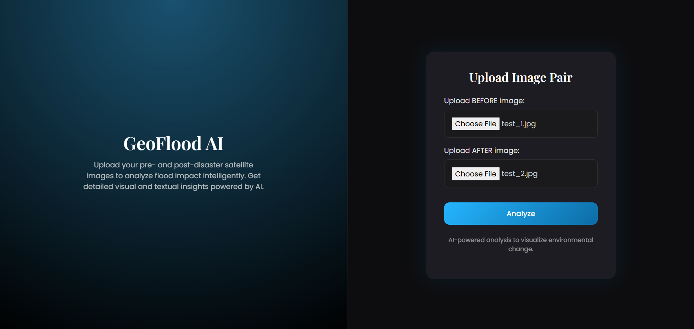
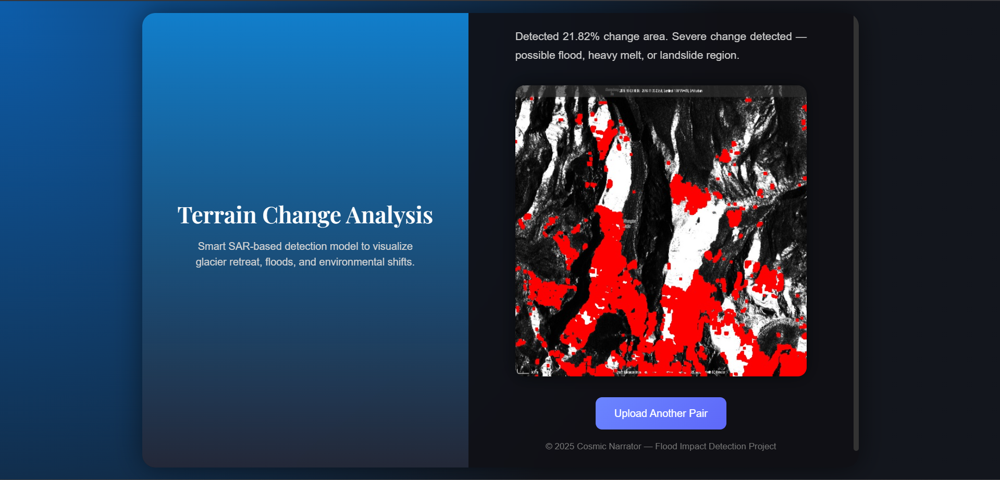

# Overview

## This Tool detects glacier change between before and after satellite images using SAR and optical data. It identifies melt zones, retreat areas, and deformation patterns — turning raw satellite data into actionable insights for climate research and disaster prediction.





## ⚙️ API Backend Setup (Flask)

This part of the project is a Python-based Flask API that serves data and handles business logic.

### Prerequisites

* **Python 3.8+**
* **Git**

### 1. Clone & Navigate

Ensure you are in the directory where you want the project to live.

```bash
git clone https://github.com/Arnab-satpati/Sikkim-Flood--Analysis-Tool.git
cd Sikkim-Flood--Analysis-Tool/
